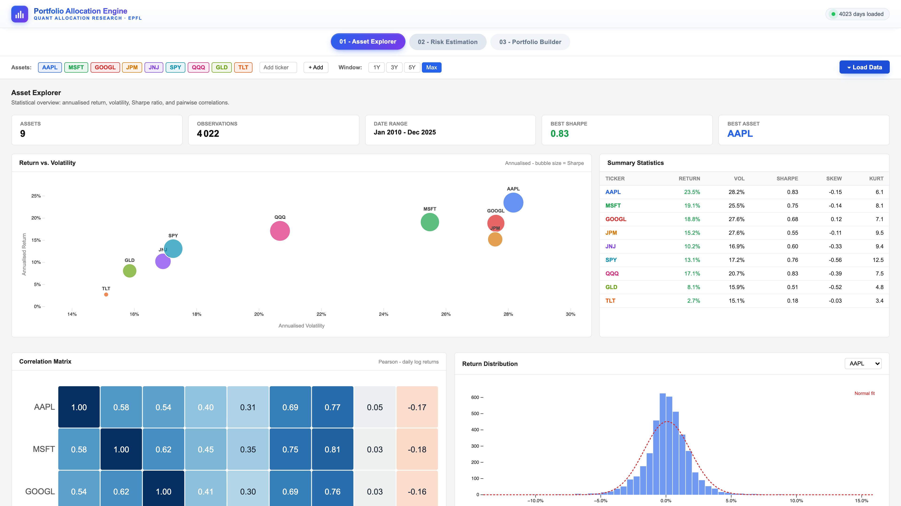
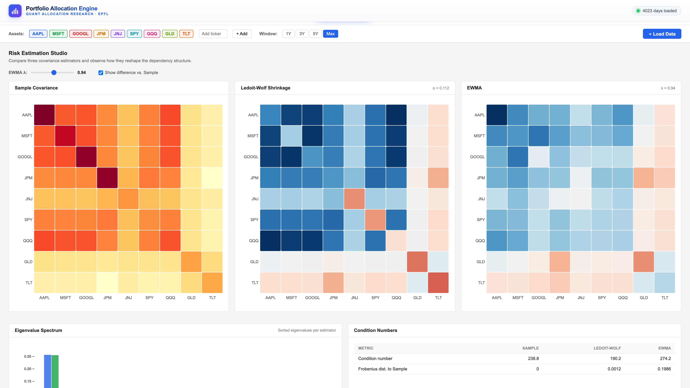
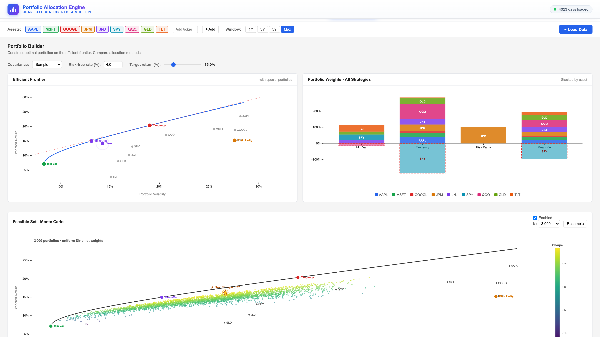
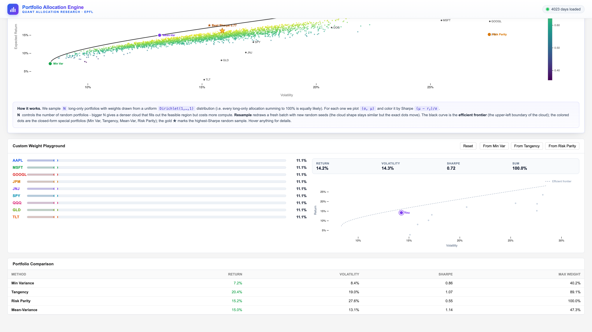

# Project of Data Visualization (COM-480)

| Student's name | SCIPER |
| -------------- | ------ |
|Petrit Arifi|362548|
|Adam Ait Bousselham|356365|
|Florian Dinant|361013| 


[Milestone 1](#milestone-1-20th-march-5pm) | [Milestone 2](#milestone-2-17th-april-5pm) | [Milestone 3](#Milestone-3-29th-May-5pm)

# Milestone 1 (20th March, 5pm)

**10% of the final grade**

## Dataset

Our project relies on financial market data initially fetched from Yahoo Finance via the `yfinance` Python library. To ensure perfect reproducibility and avoid unofficial API rate limits during grading, we have extracted a static dataset (CSV) covering daily closing prices **from January 2010 to December 2025** for a universe of 9 assets: 5 equities (AAPL, MSFT, GOOGL, JPM, JNJ), 3 ETFs (SPY, QQQ, GLD), and 1 bond ETF (TLT).

The data quality is high: Yahoo Finance provides adjusted prices that account for stock splits and dividends, which is essential for computing meaningful long-run returns. Preprocessing requirements were minimal but non-trivial: we aligned all assets to a common set of trading dates, handled occasional missing values due to instrument-specific trading halts, and computed log returns from price series. No scraping is involved. The static CSV is stored in `data/prices.csv` and can be regenerated with `python data/fetch_data.py`.


## Problematic

Modern portfolio theory has existed since Markowitz (1952), yet most retail investors and even finance students like us have never interacted with its core concepts in an intuitive, hands-on way. Our visualization project aims to bridge this gap by building an interactive Portfolio Allocation Engine that makes the abstract mathematics of portfolio construction tangible and explorable.

The central question we address is: how does the choice of risk estimation method and optimization objective affect the composition and performance of a portfolio? We want users to see, not just read, how covariance structure shapes diversification, how the efficient frontier shifts when you change assumptions, and how different methods (minimum variance, tangency, risk parity, mean-variance) lead to fundamentally different asset allocations.

Our target audience is finance and data science students, quantitative analysts early in their careers, and technically curious individuals who want to go beyond pie-chart portfolio tools. The project would ideally be structured around three progressive parts: an Asset Explorer for statistical understanding, a Risk Estimation Studio for covariance comparison, and a Portfolio Builder with an interactive efficient frontier.


## Exploratory Data Analysis

Our dataset consists of daily closing prices for 9 assets (from Jan 2010 to Dec 2025), fetched via `yfinance`. After aligning trading dates and dropping missing values, our final static dataset contains **4022 trading days**. We computed daily log returns to extract the following empirical insights, confirming the stylized facts of financial markets:

* **Risk vs. Return:** As expected, US large-cap equities are more volatile than diversified ETFs. For instance, AAPL showed an annualized return of **23.50%** with **28.16%** volatility, compared to the broader market (SPY) which had a **13.09%** return and **17.25%** volatility.
* **Diversification properties:** Safe-haven assets proved their theoretical role. The long-term bond ETF (TLT) and Gold (GLD) exhibited negative or near-zero correlation with SPY (**-0.30** and **0.05** respectively), validating them as strong portfolio diversifiers during risk-off periods.
* **Non-normality of returns:** We confirmed that daily return distributions strongly deviate from normality. Across our asset universe, we observed negative skewness (e.g., SPY: **-0.56**) and extreme excess kurtosis/fat tails (e.g., AAPL: **6.15**, SPY: **12.48**). 

Ultimately, this empirical reality is what drives our project. The data clearly shows that extreme market movements are far more common than standard Gaussian models predict, highlighting the need for better risk visualization. It demonstrates exactly why users need an interactive tool to explore different risk and covariance estimation methods (beyond simple historical variance) when building robust portfolios.

Full analysis with charts: [`eda.ipynb`](eda.ipynb).

## Related work

Several existing tools explore portfolio construction visually. Portfolio Visualizer and Riskalyze offer efficient frontier plots and risk scoring, but are closed black boxes, users cannot inspect or change the underlying estimation methodology. Academic libraries like PyPortfolioOpt implement the same mathematics in Python, but with no interactive interface. Bloomberg Terminal provides professional-grade analytics but is inaccessible outside industry.

Our approach aims to make the assumptions of portfolio construction visible and interactive, particularly the choice of covariance estimator, which is rarely surfaced in consumer tools but has a significant impact on the resulting weights. Rather than presenting a single "optimal" portfolio, we want users to explore how outputs change when inputs and methods change.

Visual inspiration comes from the Financial Times's clean, annotation-driven chart style, and from Observable notebooks, which make mathematical processes explorable through linked interactive graphics.

**Declaration of Originality:** We confirm that we have not explored this specific dataset combination nor developed this portfolio visualization concept in any previous context (such as ML, ADA courses, or past semester projects). This is an entirely original submission for this class.

# Milestone 2 (17th April, 5pm)

**10% of the final grade**

Project description (2 pages): [`Milestone2_DataViz.pdf`](Milestone2_DataViz.pdf)

Functional prototype: [`index.html`](index.html)

## How to run locally

The project is fully static (HTML + CSS + JavaScript with D3.js from CDN), but a local HTTP server is required so the browser can load `data/prices.csv`.

```bash
git clone <repo-url>
cd Quant-Allocation-Research-Team
python3 -m http.server 8080
```

Then open `http://localhost:8080/index.html` and click **Load Data**.

Any other static server works too (`npx serve`, `php -S`, etc.). Opening `index.html` directly with `file://` will fail because of CORS.

## Live demo

The dashboard is also hosted via GitHub Pages: **https://com-480-data-visualization.github.io/Quant-Allocation-Research-Team/**

## Project structure

```
.
├── index.html             # main dashboard (3 tabs)
├── engine.js              # data loading, stats, covariance, optimization, rendering
├── style.css
├── data/
│   ├── prices.csv         # 2010-2025 daily closing prices for 9 assets
│   └── fetch_data.py
├── eda.ipynb              # Milestone 1 exploratory analysis
├── requirements.txt
└── Milestone2_DataViz.pdf
```


# Milestone 3 (29th May, 5pm)

**80% of the final grade**

## Portfolio Allocation Engine

> Interactive D3.js visualization that turns Modern Portfolio Theory from
> abstract equations into something you can *see*, *touch*, and *play with*.

**COM-480 - Data Visualization · EPFL · Final Milestone**

🔗 **Live demo:** https://com-480-data-visualization.github.io/Quant-Allocation-Research-Team/  
🎬 **Screencast (2 min):** https://www.youtube.com/watch?v=MlQdPHd0oeo  
📄 **Process book:** [`process_book.pdf`](./process_book.pdf)










---

### Table of contents

1. [What is this?](#what-is-this)
2. [Features](#features)
3. [Technical highlights](#technical-highlights)
4. [Quick start](#quick-start)
5. [Project structure](#project-structure)
6. [Dataset](#dataset)
7. [How it works (math in 60 seconds)](#how-it-works-math-in-60-seconds)
8. [Acknowledgments](#acknowledgments)

---

### What is this?

**Portfolio Allocation Engine** is a single-page web application that lets a
non-specialist build, optimize and stress-test a stock portfolio using the
toolbox that quantitative finance has refined for the last 70 years -
Markowitz mean-variance optimization, Sharpe ratios, Ledoit-Wolf shrinkage,
EWMA covariance, Risk Parity, and Monte-Carlo feasibility clouds.

Everything that *moves* on the page is computed live, from the raw daily
prices, in your browser, with no Python backend and no charting library
beyond D3. Pick assets, change the look-back window, slide the EWMA decay
parameter, and the entire pipeline - statistics, three covariance estimators,
four optimal portfolios, the efficient frontier, and a 10 000-point random
cloud - recomputes and re-renders in real time.

### Features

The app is organised as a three-act narrative across three tabs.

#### `01 - Asset Explorer`
Get to know the assets before optimizing them.
- KPI strip (best Sharpe, observation count, date range)
- **Return vs. Volatility scatter** with bubble size encoding Sharpe
- Sortable summary table (return, vol, Sharpe, skew, kurtosis)
- **Pairwise correlation heatmap** with on-cell annotations
- Return distribution histogram with normal-fit overlay
- Cumulative performance ($1 growth) chart
- **Rolling volatility, Sharpe, and pairwise correlation** with selectable
  windows (30 / 60 / 90 / 252 days) and selectable anchor asset

#### `02 - Risk Estimation Studio`
Three covariance estimators side-by-side.
- Sample covariance (the textbook noisy default)
- **Ledoit-Wolf shrinkage** with shrinkage intensity α displayed
- **EWMA** with an interactive λ slider (0.88 – 0.99)
- One-click **"Show difference vs. Sample"** toggle re-encodes the heatmaps
  on a divergent diff scale
- **Eigenvalue spectrum** (3 estimators superimposed)
- Condition number and Frobenius distance table
- Marchenko–Pastur: Signal vs Noise
- Rolling Top Eigenvalue and Rolling Condition Number with selectable
  windows (126 / 252 / 504 days)

#### `03 - Portfolio Builder`
Where the geometry of optimization comes alive.
- **Efficient frontier** with the four named portfolios:
  Min-Variance · Tangency · Risk Parity · Mean-Variance (target return)
- **Stacked-bar** weight comparison across all four strategies, with shorts
  rendered with dashed red borders
- **Monte-Carlo feasible cloud** (1k – 10k Dirichlet-sampled portfolios),
  animated as it draws, coloured by Sharpe, with a pulsing star locked onto
  the running best
- **Custom Weight Playground** - drag per-asset sliders to build your own
  long-only portfolio with live return / volatility / Sharpe readout, or
  one-click load the Min-Var / Tangency / Risk-Parity weights as a starting
  point
- Live performance comparison table

### Technical highlights

- **No charting library** beyond D3.js - every axis, scale, transition and
  hover is hand-built
- **No optimization or stats library** - everything from scratch in plain JS:
  - Gauss-Jordan matrix inversion
  - Jacobi rotation eigenvalue solver
  - Closed-form Markowitz frontier
  - Ledoit-Wolf shrinkage intensity $\alpha$ (asymptotic optimal)
  - Dirichlet sampling via the Gamma trick (`-log(1-U)`)
  - Iterative Risk-Parity solver
- **Hybrid SVG + Canvas** rendering - SVG for the static frame and crisp
  axes, `<canvas>` overlay for the 10 000-point Monte-Carlo cloud so it stays
  smooth at 60 fps
- **Animation as pedagogy** - the MC cloud paints in over 2.6 s with a
  cubic-out easing, and the running-best star jumps and pulses to make the
  optimization process *visible*
- **Single-pass state pipeline** - `loadData → filterPrices → computeStats →
  computeCovariances → computePortfolios → render*` runs in under 200 ms for
  the default 9-asset / 3-year window

### Quick start

Go to https://com-480-data-visualization.github.io/Quant-Allocation-Research-Team/

OR

```bash
# Clone
git clone https://github.com/com-480-data-visualization/Quant-Allocation-Research-Team
cd Quant-Allocation-Research-Team

# Serve (any of these works - pick one)
python3 -m http.server 8000          # Python (recommended)
npx serve .                          # Node
php -S localhost:8000                # PHP
```


### Project structure

```
.
├── index.html          # Layout, tabs, controls
├── style.css           # All styling (no preprocessor)
├── engine.js           # Stats + estimators + optimization + D3 renderers
├── data/
│   └── fetch_data.py   # Allows to fetch data for free using Yahoo finance
│   └── prices.csv      # Daily adjusted closes
├── eda.ipynb           # Notebook that allowed us to get insight on the data for Milestone 1
├── Milestone2_DataViz.pdf    # Milestone 2 report
├── process_book.pdf    # 8-page report (final deliverable)
├── README.md           # this file
├── requirements.txt    # list of libraries you need to install
├── favicon.svg         # icon for the website for a more prefessional rendering
├── .github/workflows/
│   └── pages.yml       # Allows the quick demo via github
└── .gitignore          

```

### Dataset

`data/prices.csv` is a wide-format CSV with one `Date` column and one
adjusted-close column per ticker. The default basket is intentionally
diversified so the optimizer has interesting trade-offs to make:

| Asset | What it is |
|---|---|
| `AAPL`, `MSFT`, `GOOGL` | Large-cap US tech |
| `JPM` | US financials |
| `JNJ` | Defensive healthcare |
| `SPY` | S&P 500 ETF (broad equity beta) |
| `QQQ` | Nasdaq-100 ETF (tech beta) |
| `GLD` | Gold (alternative / inflation hedge) |
| `TLT` | Long-duration US Treasuries |

You can add any additional ticker by adding manually the corresponding prices in `data/prices.csv` or directly by adding the ticker into the list in `data/fetch_data.py` and then run it. You then have the ability to add to the analysis by clicking the **+ Add** chip in the controls bar.

### How it works (math in 60 seconds)

Given $T$ daily prices for $n$ assets, the engine first builds log-returns
$r_t = \log(P_t / P_{t-1})$, then annualises:

$$\hat\mu = 252 \cdot \overline{r}, \qquad
  \hat\Sigma = 252 \cdot \frac{1}{T-1}\sum_t (r_t - \overline{r})(r_t - \overline{r})^\top$$

Two regularised alternatives are computed in parallel:
**Ledoit-Wolf shrinkage** $\hat\Sigma_{\mathrm{LW}} = \alpha\, \mathrm{tr}(\hat\Sigma)/n \cdot I + (1-\alpha)\hat\Sigma$ with
the asymptotically optimal $\alpha$, and **EWMA** with decay $\lambda$.

Optimal portfolios are obtained in closed form from the Lagrangian of
mean-variance optimisation, and the efficient frontier is parameterised by
target return $\mu^\star$:
$$w^\star(\mu^\star) = \Sigma^{-1}\left( \lambda_1\,\mathbf{1} + \lambda_2\,\mu \right)$$
The Risk-Parity weights are obtained by fixed-point iteration on the
condition that each asset contributes equally to portfolio variance.

### Acknowledgments

- Daily price data sourced from Yahoo Finance via the `yfinance` Python
  package
- D3.js - Mike Bostock and contributors
- Inspiration drawn from Markowitz (1952), Ledoit & Wolf (2004), and
  Maillard, Roncalli & Teiletche (2010) for risk parity


## Late policy

- < 24h: 80% of the grade for the milestone
- < 48h: 70% of the grade for the milestone
